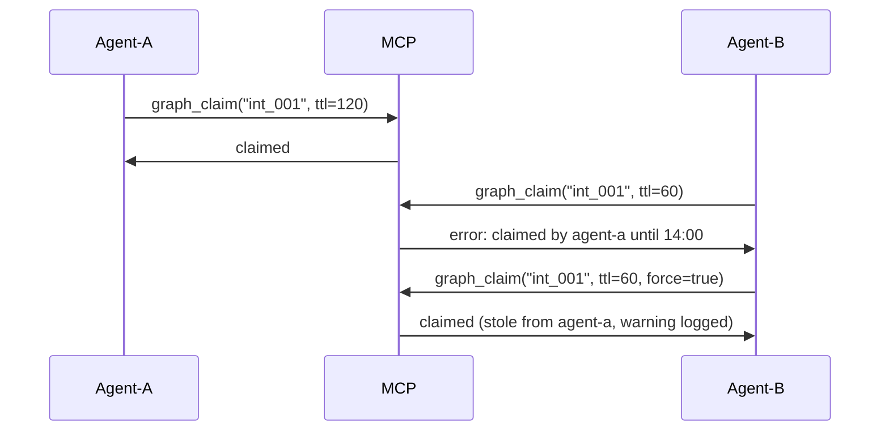

# Project Knowledge Graph — Build Plan

## Vision

A **queryable, self-correcting project brain** where every entity (symbol, file, module, intent, commit, test, dependency, config key, guardrail) is a node in a graph, every relationship (calls, imports, tests, co-changes, supersedes, resolves) is an edge, and every edge carries a rationale with traceable confidence. Agents don't read flat context dumps — they ask targeted questions.

```
                    Decision
                       │
                       │ relates_to
                       ▼
  Commit ──modifies──▶ Symbol ◀──tests── Test
   │                    │
   │ co_changes_with    │ imports
   ▼                    ▼
  File ──────────────▶ Module ──depends_on──▶ DepPackage
   │                                         │
   │ co_changes_with              supply_chain_risk
   ▼                                         ▼
  File (unrelated)                       Intent (auto)
```

---

## Principles

1. **Queryable, not dumpable** — a flat context dump breaks at scale. Expose targeted graph traversals via an MCP server so agents ask "what's the blast radius of changing this function?" not "give me everything."
2. **Rationale over verdict** — every "unstable" carries "12 commits in 30 days, lines 40-80" as attachable evidence. Surface analysis tier confidence so agents weight claims accordingly.
3. **Hidden coupling** — co-change coupling (files that historically change together with no import relationship) is the differentiated insight static analysis alone cannot see.
4. **Self-correcting** — when an agent acts on an intent and it gets merged or reverted, record the outcome. Over time, calibrate severity scoring against what actually helped versus what got walked back.
5. **Offline-first** — no network calls for core graph operations. Local semantic search uses a small local embedding model, keeping the "no internet" promise.
6. **Multi-agent coordination** — 2026 means parallel agent sessions. Lightweight `dizz claim` / `dizz release` with TTL prevents duplicate work.

---

## Graph Model

### Node Types

| Node | Source | Rationale Carried |
|---|---|---|
| `symbol` | `state.Symbol` | Analysis tier (ast/lexical/regex), confidence, line range, churn count, instability score |
| `file` | `state.FileContext` | Language, churn count, last modified, is_generated, is_protected |
| `module` | Package grouping (go.mod, package.json, Cargo.toml, etc.) | Module path, version, type (library/app) |
| `intent` | `state.Intent` | Severity, status, type, created_by, outcome (merged/reverted) |
| `commit` | `integrations.Commit` | Message, timestamp, author, change size |
| `test` | Test file detection | Test framework, coverage estimate (none/unit/integration) |
| `dep` | External dependency | Version, staleness, known vulnerabilities |
| `config_key` | Env vars, config files | Scope, default value, is_secret |
| `guardrail` | `config.Guardrail` | Action, reason, path scope |
| `signal_source` | Pluggable (CI, runtime, incidents) | Source type, timestamp, payload summary |

### Edge Types

| Edge | From | To | How Extracted | Rationale |
|---|---|---|---|---|
| `DEFINED_IN` | symbol | file | Direct from `Symbol.File` | File path |
| `CONTAINS` | file | symbol | Inverse of DEFINED_IN | Symbol count |
| `CONTAINS` | module | file | Package detection | Module path |
| `CALLS` | symbol | symbol | `FunctionCalled` → `FunctionDefined` match | Line number, call site file, confidence |
| `IMPORTS` | file | file | `ImportFound` → local resolution | Import path, line number |
| `IMPORTS` | file | module | `ImportFound` → package boundary | Module path |
| `DEPENDS_ON` | file | dep | `ImportFound` → non-local | Import path, version |
| `TESTS` | test | symbol | Naming convention + import proximity | Match method (naming=0.9, imports=0.6), confidence |
| `MODIFIED_BY` | symbol | commit | `git log -L` | 12 commits in 30 days, lines 40-80 |
| `CHANGED_IN` | file | commit | `git log --name-only` | Commit hash, change size |
| **`CO_CHANGES_WITH`** | file | file | `git log` association analysis | N co-occurrences in M commits, Jaccard similarity |
| `RESOLVES` | commit | intent | `dizz snapshot --reason "int_xxx: ..."` | Snapshot hash, reason string |
| `SUPERSEDES` | symbol | symbol | Refactor lineage (same name, different file) | Old file, new file, commit range |
| `SCOPE_MATCH` | intent | file | `Intent.Scope` glob | Scope pattern |
| `RELATES_TO` | decision | symbol/file | `Decision.Scope` matching | Decision ID |
| `BLOCKS` | task | task | `Task.DependsOn` | Task ID |
| `HAS_RISK` | dep | intent | Supply chain scan (auto-generated) | CVE ID, severity |
| `PROTECTS` | guardrail | file | `Guardrail.Paths` glob | Guardrail action + reason |
| `DECLARES` | file | config_key | Env/config file parsing | Key name, default value |
| `HAS_OUTCOME` | intent | commit | Merge/revert detection after intent resolution | Outcome type (merged/reverted/reopened) |

### Co-Change Coupling (Differentiator)

This is what makes the graph genuinely valuable. Two files with no import relationship but historically modified in the same commits reveal hidden architectural coupling.

```
# algorithm (embedded in builder.go)
for each commit c in git log:
    files = filesChangedIn(c)
    for each pair (f1, f2) in files:
        coChangeCount[f1][f2] += 1

# Normalize by Jaccard similarity:
# jaccard(f1, f2) = |commits(f1) ∩ commits(f2)| / |commits(f1) ∪ commits(f2)|
# Threshold: jaccard > 0.3 → CO_CHANGES_WITH edge with weight = jaccard

# Exclude pairs that already have IMPORTS edges (those are already visible)
# Only surface CO_CHANGES_WITH for pairs with no import relationship
```

Stored as edges with:
- `weight` = Jaccard similarity (0.3-1.0)
- `attrs` = `"co_occurrences=12,total_commits_f1=30,total_commits_f2=40"`

This surfaces things like: "every time you change the database schema, you also change the API response mapper" — no import relationship, but structurally coupled.

---

## Architecture

### Two-Interface Design

```
┌────────────────────────────────────┐
│            dizz CLI                │
│  dizz graph query "blast radius"   │
│  dizz graph query --agent          │
└──────────┬─────────────────────────┘
           │
           ▼
┌────────────────────────────────────┐
│       internal/graph/              │
│  (Go library, embeddable)          │
│  Graph.Build()                     │
│  Graph.Query()                     │
│  Graph.ImpactScope()               │
│  Graph.ShortestPath()              │
└──────┬──────────────────────┬──────┘
       │                      │
       ▼                      ▼
┌──────────────┐    ┌──────────────────┐
│ .dizz/graph/ │    │   MCP Server     │
│ (TON files)  │    │ (stdio transport) │
└──────────────┘    │ dizz mcp         │
                    └──────────────────┘
```

### Package Layout

```
internal/graph/
  node.go               # Node type, NodeID, attributes with rationale
  edge.go               # Edge type, direction, weight, rationale
  graph.go              # In-memory graph (adjacency list + indices)
  builder.go            # Build graph from ProjectState + IntentState + signals + git
  cochange.go           # Co-change coupling analysis
  testlink.go           # Test-to-symbol linkage
  import_resolve.go     # Cross-language import → local file resolution
  query.go              # Query engine (traversals, filters, paths, blast radius)
  persist.go            # TON serialization + binary indexes
  diff.go               # Graph delta between snapshots
  feedback.go           # Outcome recording and severity calibration
  claim.go              # Multi-agent claim/release with TTL
  supplychain.go        # Dependency health analysis (auto-intents)
  signals.go            # Pluggable signal source interface (CI, runtime, incidents)
  monorepo.go           # Workspace/package boundary detection
  semantic.go           # Local embedding search over graph text
  agent_tui.go          # TON output for agent consumption

cmd/
  graph.go              # dizz graph (build, query, stats, viz, diff)
  mcp.go                # dizz mcp (MCP stdio server)
  claim.go              # dizz claim / dizz release

store/
  graphstore.go         # GraphNode store + edge store + index store
  feedbackstore.go      # Outcome records
  claimstore.go         # Active claims with TTL
```

---

## MCP Server (`dizz mcp`)

The MCP (Model Context Protocol) server exposes the graph as callable tools, not a dump. This is the primary agent interface.

### Transport: stdio (no network, no config, works offline)

### Tools

```json
// Tool 1: Blast radius
{
  "name": "graph_blast_radius",
  "description": "What breaks if I change this symbol/file?",
  "inputSchema": {
    "entity": "symbol:<name>@<file>" | "file:<path>",
    "depth": 3 // transitive depth
  },
  "output": {
    "affected": [
      {"node": "symbol:LoginHandler", "score": 0.9, "via": ["CALLS", "TESTS"]},
      {"node": "file:handler_test.go", "score": 0.8, "via": ["TESTS"]}
    ],
    "summary": "12 entities affected across 4 files, 2 intents, 1 decision"
  }
}

// Tool 2: Co-change coupling
{
  "name": "graph_cochanges",
  "description": "What files historically change together with this file?",
  "inputSchema": {
    "file": "<path>",
    "min_jaccard": 0.3
  },
  "output": {
    "coupled": [
      {"file": "db/migrations.go", "jaccard": 0.6, "co_commits": 12, "total_commits_f1": 30},
      {"file": "api/mapper.go", "jaccard": 0.45, "co_commits": 8, "total_commits_f1": 25}
    ],
    "unexpected": 2 // count of pairs with no import relationship
  }
}

// Tool 3: Test coverage for symbol
{
  "name": "graph_test_coverage",
  "description": "Which tests cover a given symbol?",
  "inputSchema": {
    "symbol": "<name>",
    "file": "<path>"
  },
  "output": {
    "tests": [
      {"test": "TestLogin", "file": "handler_test.go", "confidence": 0.9, "method": "naming"}
    ],
    "has_test": true,
    "test_ratio": 0.75 // what fraction of callers are tested
  }
}

// Tool 4: Symbol trace
{
  "name": "graph_symbol_trace",
  "description": "Full trace of a symbol: what it calls, what calls it, its intents, its commits",
  "inputSchema": {
    "symbol": "<name>",
    "file": "<path> (optional)"
  },
  "output": {
    "symbol": {"name": "LoginHandler", "state": "unstable", "confidence": 0.8},
    "rationale": {
      "instability_score": 12.4,
      "churn": "12 commits in 30 days",
      "source_tier": "ast",
      "line_range": "40-80"
    },
    "callers": [{"symbol": "RouteHandler", "file": "routes.go", "confidence": 0.9}],
    "callees": [{"symbol": "AuthService.Authenticate", "file": "service.go", "confidence": 0.85}],
    "intents": [{"id": "int_001", "msg": "Refactor auth middleware", "severity": 2}],
    "tests": [{"test": "TestLogin", "file": "handler_test.go"}],
    "commits": [{"hash": "a1b2c3d", "msg": "Add JWT support", "age": "30d"}],
    "co_changes": [{"file": "middleware.go", "jaccard": 0.5}]
  }
}

// Tool 5: Claim/Release (multi-agent coordination)
{
  "name": "graph_claim",
  "description": "Claim an intent to prevent duplicate work across agents",
  "inputSchema": {
    "intent_id": "int_001",
    "ttl_minutes": 120,
    "agent_id": "opencode-session-abc"
  },
  "output": {"claimed": true, "expires_at": "2026-07-27T14:00:00Z"}
}
{
  "name": "graph_release",
  "inputSchema": {"intent_id": "int_001", "agent_id": "opencode-session-abc"},
  "output": {"released": true}
}

// Tool 6: Supply chain health
{
  "name": "graph_supply_chain",
  "description": "Stale or vulnerable dependencies as auto-generated intents",
  "inputSchema": {
    "min_severity": "medium"
  },
  "output": {
    "risks": [
      {"dep": "golang.org/x/crypto", "version": "v0.15.0", "latest": "v0.26.0", "stale_days": 180, "intent_id": "auto_supply_001"},
      {"dep": "lodash", "version": "4.17.20", "known_vulns": 3, "intent_id": "auto_supply_002"}
    ]
  }
}

// Tool 7: Semantic search
{
  "name": "graph_semantic_search",
  "description": "Find nodes by natural language description (local, offline)",
  "inputSchema": {
    "query": "payment retry logic",
    "node_types": ["symbol", "file", "intent", "commit"],
    "max_results": 10
  },
  "output": {
    "results": [
      {"id": "symbol:payment.go::RetryPayment", "type": "symbol", "score": 0.87, "snippet": "func RetryPayment(..."},
      {"id": "intent:int_042", "type": "intent", "score": 0.72, "snippet": "Implement payment retry with exponential backoff"}
    ]
  }
}

// Tool 8: Agent outcome recording
{
  "name": "graph_record_outcome",
  "description": "Record what happened when an agent acted on an intent",
  "inputSchema": {
    "intent_id": "int_001",
    "outcome": "merged" | "reverted" | "reopened",
    "commit_hash": "a1b2c3d",
    "note": "PR #42 was merged but reverted 2 days later due to perf regression"
  },
  "output": {"recorded": true}
}
```

### MCP Server Implementation

```go
// cmd/mcp.go
// Registers as subcommand: dizz mcp
// Runs an MCP-over-stdio server
// Each tool calls into internal/graph/query.go

func init() {
    rootCmd.AddCommand(mcpCmd)
}

var mcpCmd = &cobra.Command{
    Use:   "mcp",
    Short: "Start MCP stdio server for agent graph queries",
    RunE: func(cmd *cobra.Command, args []string) error {
        graph, err := graph.LoadGraph(trackDir)
        if err != nil {
            return fmt.Errorf("load graph: %w\nrun 'dizz graph build' first", err)
        }
        server := mcp.NewServer(graph)
        return server.ServeStdio()
    },
}
```

MCP server uses `encoding/json` for stdio communication (stdlib, no extra deps). Full MCP spec compliance for tool registration and invocation.

---

## Build Phases

### Phase 1: Core Graph + Storage (Week 1)

**Deliverables:**
- `internal/graph/node.go` — Node, NodeID, NodeType, Rationale struct
- `internal/graph/edge.go` — Edge, EdgeType, Weight, Rationale struct
- `internal/graph/graph.go` — In-memory adjacency list with indices
- `internal/graph/persist.go` — TON save/load for nodes and edges
- `store/graphstore.go` — Atomic save, load, append-only edge log

**Rationale struct** (carries evidence, not just verdict):
```go
type Rationale struct {
    SourceTier  string  `json:"source_tier,omitempty"`  // ast, lexical, regex
    Confidence  float64 `json:"confidence"`              // 0.0-1.0
    Evidence    string  `json:"evidence,omitempty"`      // "12 commits in 30 days"
    LineRange   string  `json:"line_range,omitempty"`    // "40-80"
    Timestamp   int64   `json:"timestamp,omitempty"`
    SourceType  string  `json:"source_type,omitempty"`   // "git", "static_analysis", "ci", "incident"
}
```

Every `Edge` carries a `Rationale`. Every `Node` carries analysis `Rationale`.

**Storage layout:**
```
.dizz/graph/
  nodes.ton           # node registry (append-only)
  edges.ton           # edge list (append-only, time-ordered)
  index/
    outgoing/         # binary adjacency indexes (built on graph build)
    incoming/
  version             # "1"
```

---

### Phase 2: Builder + Co-Change Coupling (Week 2)

**Deliverables:**
- `internal/graph/builder.go` — Extract nodes/edges from existing dizz data
- `internal/graph/cochange.go` — Co-change coupling analysis from git log
- `internal/graph/import_resolve.go` — Cross-language import resolution
- `cmd/graph.go` — `dizz graph build`, `dizz graph stats`

**Co-change algorithm** (cochange.go):

```
1. Collect all commits from git log (up to configurable depth, default 1000)
2. For each commit, get the list of files changed
3. Build co-occurrence matrix:
   type CoChange struct {
       FileA, FileB string
       CoOccurrences int
       CommitsA      int  // total commits touching FileA
       CommitsB      int
   }
4. For each pair with jaccard >= threshold (default 0.3):
   - jaccard = coOccurrences / (commitsA + commitsB - coOccurrences)
   - Exclude pairs already connected by IMPORTS edge
   - Create CO_CHANGES_WITH edge with:
     weight = jaccard
     rationale = "N co-occurrences in M commits, jaccard=0.X"
```

**Performance:** For 1000 files × 500 commits, the pair computation is O(n²) in files per commit. Optimize by:
- Only considering files that appear in >= 3 commits (filter noise)
- Parallel commit processing with worker pool (reuse existing 8-worker pattern)
- Only storing pairs above threshold

---

### Phase 3: Test Linkage + Import Resolution (Week 2-3)

**Deliverables:**
- `internal/graph/testlink.go` — Test-to-symbol linking across 34 languages
- `internal/graph/import_resolve.go` — Go/Python/TS/Rust import resolution

**Test linkage methods** (in priority order):

1. **Naming convention** (confidence 0.9):
   - Go: `TestLogin` → tests `Login` (strip `Test` prefix)
   - Python: `test_login` → tests `login`
   - Rust: `login_test` → tests `login`
   - TS/JS: `test('login')` / `describe('login')` → tests `login`

2. **Import proximity** (confidence 0.6):
   - If test file imports production module, link test → all exported symbols from that module
   
3. **Coverage data** (confidence 0.95, when available):
   - If CI pipeline provides coverage JSON (go test -coverprofile, pytest --cov), import and link directly

---

### Phase 4: Queries + Blast Radius (Week 3)

**Deliverables:**
- `internal/graph/query.go` — Query engine with traversals
- `internal/graph/diff.go` — Graph delta between snapshots

**Query types:**

| Query | Method | Use Case |
|---|---|---|
| `blast_radius(entity, depth)` | Transitive outgoing traversal with weight decay | "What breaks if I change X?" |
| `test_coverage(symbol)` | Incoming TESTS edges | "Is this tested?" |
| `cochanges(file, min_jaccard)` | Outgoing CO_CHANGES_WITH edges | "What's hidden-coupled?" |
| `trace(symbol)` | Full bidirectional traversal | "Everything about LoginHandler" |
| `path(from, to)` | BFS shortest path | "How are these connected?" |
| `impact_scope(scope_glob)` | Subgraph match | "What's in internal/auth/?" |
| `unused_deps()` | DEPENDS_ON with no incoming CALLS | "Dead dependencies" |
| `supply_chain_risks(min_sev)` | HAS_RISK edges grouped by dep | "Stale packages" |

**Blast radius scoring:**
```
blast_score(node, depth):
  if depth == 0: return 0
  score = 1.0  // the node itself
  for each outgoing edge:
    decay = edge.weight / depth
    score += decay * blast_score(target, depth-1)
  return score
```

---

### Phase 5: MCP Server (Week 3-4)

**Deliverables:**
- `internal/graph/mcp/` (or `cmd/mcp.go` with embedded protocol handling)
- `dizz mcp` command
- Tool registration for all 8 tools listed above

**MCP wire format** (JSON-RPC over stdio):

```json
// Request
{"jsonrpc": "2.0", "id": 1, "method": "tools/call", "params": {
  "name": "graph_blast_radius",
  "arguments": {"entity": "symbol:LoginHandler@handler.go", "depth": 2}
}}

// Response
{"jsonrpc": "2.0", "id": 1, "result": {
  "content": [{"type": "text", "text": "{\"affected\": [...], \"summary\": \"...\"}"}]
}}
```

Full MCP spec: https://spec.modelcontextprotocol.io

---

### Phase 6: Multi-Agent Claims + Outcome Feedback (Week 4)

**Deliverables:**
- `internal/graph/claim.go` — Claim/release with TTL
- `internal/graph/feedback.go` — Outcome recording + severity calibration
- `cmd/claim.go` — `dizz claim <intent-id>`, `dizz release <intent-id>`

**Claim protocol:**
```
dizz claim int_001 --ttl 120            # claim for 2 hours
dizz claim int_001 --ttl 120 --force    # steal claim (logs warning)
dizz release int_001                     # release early
dizz claim list                          # show active claims
```

Stored in `.dizz/claims.ton`:
```
intent_id|agent_id|claimed_at|ttl_minutes|expires_at
int_001|opencode-session-abc|1743012345|120|1743013545
```

**Outcome feedback loop:**

```go
type Outcome struct {
    IntentID    string    `json:"intent_id"`
    Outcome     string    `json:"outcome"` // "merged", "reverted", "reopened"
    CommitHash  string    `json:"commit_hash,omitempty"`
    Note        string    `json:"note,omitempty"`
    RecordedAt  time.Time `json:"recorded_at"`
    AgentID     string    `json:"agent_id,omitempty"`
}
```

Over time, the feedback store enables:
- `intent.Severity` calibration: if severity-3 intents get reverted 60% of the time, lower auto-severity for that type
- `SuggestNextAction` calibration: if "fix unstable" actions get reverted more than "implement planned" actions, reorder priority
- Stored in `.dizz/feedback.ton` (append-only log)

---

### Phase 7: Supply Chain + Guardrails + Monorepo (Week 4-5)

**Deliverables:**
- `internal/graph/supplychain.go` — Dependency health analysis
- `internal/graph/monorepo.go` — Package boundary detection
- Auto-generated intents for stale/vulnerable deps

**Supply chain analysis** (works offline):
- Parse `go.mod`, `package.json`, `Cargo.toml`, etc.
- No network calls (can't fetch latest versions without internet, but CAN detect:
  - Version pinned vs. range
  - Known vulnerability databases if bundled (optional)
  - Deprecation notices in dependency files
- Auto-generate `HAS_RISK` edges and corresponding intents:
  ```
  dizz intent add "Dependency golang.org/x/crypto v0.15.0 is 180 days stale" \
    --type todo --severity 2 --tags "supply-chain,auto-generated"
  ```

**Monorepo/workspace detection:**
- Detect `go.mod` files per directory → module boundaries
- Detect `package.json` with `workspaces` → npm/yarn workspaces
- Detect `Cargo.toml` with `[workspace]` → Rust workspace
- Create `module` nodes with `CONTAINS` edges to files
- Cross-module imports get lower confidence (boundary crossing is architecturally significant)

**Guardrail/protected-path integration:**
- Guardrails from `config.Guardrail` become `guardrail` nodes
- `PROTECTS` edges link guardrails to file nodes matching `Guardrail.Paths`
- Agent querying blast radius sees: "this file is PROTECTED by guardrail 'never modify generated code'"
- `dizz context --graph` includes active guardrails affecting current scope

---

### Phase 8: Local Semantic Search (Week 5)

**Deliverables:**
- `internal/graph/semantic.go` — Local embedding search
- `dizz graph search "natural language query"`

**Architecture:**
- Use a small, bundled embedding model (e.g., a tiny word2vec-style model in Go, ~2MB)
- Embed on: symbol names, file names, intent messages, commit messages, TODO text
- Build an in-memory cosine similarity index on `dizz graph build`
- No network calls, no external API, no Python runtime

```go
type SemanticIndex struct {
    embeddings map[NodeID][]float32 // 128-dim vectors
    nodes      []NodeID
}

func (idx *SemanticIndex) Search(query string, k int) []SearchResult
func BuildSemanticIndex(g *Graph) *SemanticIndex
```

Storage: `.dizz/graph/semantic.index` (binary, mmap-able)

**Why this matters:** "Where's the payment retry logic?" should work without exact name matching. This keeps the offline promise intact while solving the "I don't know what it's called" problem.

---

### Phase 9: CI/Runtime Signal Sources (Week 5-6)

**Deliverables:**
- `internal/graph/signals.go` — Pluggable signal source interface
- Built-in: CI test result ingestion
- Built-in: Build failure ingestion

**Signal source interface:**
```go
type SignalSource interface {
    Name() string
    Fetch() ([]SignalEvent, error)
}

type SignalEvent struct {
    Source      string            // "ci", "incident", "runtime"
    Type        string            // "test_failure", "build_failure", "incident"
    TargetID    NodeID            // affected node
    Payload     map[string]string // source-specific data
    Timestamp   time.Time
    Confidence  float64
}
```

**CI ingestion** (via `dizz graph ingest-ci --file results.json`):
- Parse JUnit XML, Go test JSON, pytest JSON
- Link test failures to test nodes → symbol nodes
- Create temporary edges with decay (failure confidence decays over time)
- Stored in `.dizz/graph/signals/` directory

---

## Integration with Existing dizz

### `dizz context` — Graph-Aware

New optional `--graph` flag appends a compact graph summary:

```ton
# graph
edge_type|count
CALLS|1243
CO_CHANGES_WITH|86
TESTS|42

# impact (entities needing attention, with rationale)
node|state|rationale
symbol:handler.go::LoginHandler|unstable|12 commits/30d lines 40-80 (ast)
symbol:service.go::AuthService|unused|not called in 90d, last commit a1b2c3d
```

Controlled by:
- `dizz context --graph` — include graph summary
- `dizz context --graph=impact` — only entities needing attention
- `dizz context --graph=cochange` — only co-change couplings

### `dizz snapshot` — Graph Delta

Extend `SnapshotDelta`:

```go
type GraphDelta struct {
    NodesAdded     []*Node       `json:"nodes_added,omitempty"`
    NodesRemoved   []NodeID      `json:"nodes_removed,omitempty"`
    EdgesAdded     []*Edge       `json:"edges_added,omitempty"`
    EdgesRemoved   []string      `json:"edges_removed,omitempty"`
    CoChangesNew   []CoChange    `json:"co_changes_new,omitempty"` // new hidden couplings
}
```

### `dizz log` — Graph Insights

New `--graph` flag adds:
```
dizz log --graph
  LoginHandler: calls 5 symbols, called by 3, tested by 1 test, co-changes with 2 files
  Unstable areas: auth/ (7 unstable symbols, 4 co-change clusters)
  Hidden coupling: handler.go ↔ middleware.go (jaccard 0.6, no import)
```

---

## How Agents Use This

### Workflow: "Refactor LoginHandler"

```mermaid
sequenceDiagram
    Agent->>MCP: graph_symbol_trace("LoginHandler")
    MCP->>Agent: unstable, 12 commits/30d, 3 callers, 1 test, 5 callees
    Agent->>MCP: graph_blast_radius("LoginHandler", depth=2)
    MCP->>Agent: 8 entities affected, 2 intents match
    Agent->>MCP: graph_cochanges("handler.go")
    MCP->>Agent: co-changes with middleware.go (jaccard 0.6) — no import!
    Agent->>MCP: graph_claim("int_001", ttl=120)
    MCP->>Agent: claimed
    Agent->>Human: "Refactoring LoginHandler. Tests exist (TestLogin). 
                     Hidden coupling with middleware.go found. 
                     Blast radius: 8 entities. Claimed intent int_001. Proceed?"
    Human->>Agent: "Go ahead"
    Agent->>Code: implements refactor
    Agent->>MCP: graph_record_outcome("int_001", "merged", commit=abc123, note="PR #42")
```

### Workflow: Multi-Agent Coordination



---

## How This Replaces AGENTS.md

| AGENTS.md Section | Replace With | Phase |
|---|---|---|
| Purpose / overview | `dizz context --graph` + MCP `graph_help` tool | P5 |
| How dizz helps remember state | `dizz context --graph` + `graph_symbol_trace` | P5 |
| Cleaning unused code | `graph_blast_radius` + `graph query "unused deps"` | P4 |
| Maintaining TODOs/Intent | Existing `dizz intent` + `graph_claim` for coordination | P6 |
| Guidelines for AI agents | `dizz knowledge` (from plan.md v1) + guardrail nodes in graph | P7 |
| Example workflow | MCP tools are the workflow — agents call don't read | P5 |
| Language registry | `graph stats --by-tier` | P1 |
| Agent rulesets & patterns | `KNOWLEDGE_FOR` edges + `PROTECTS` edges from guardrails | P7 |
| TON format description | Self-describing via MCP tool schemas | P5 |
| Ignore flag architecture | Guardrail nodes with `PROTECTS` edges | P7 |

After Phase 6, AGENTS.md is reduced to: "Run `dizz mcp` and use the MCP tools. Read `dizz help` for CLI commands."

---

## Guiding Principles

1. **Backward compatible** — all new features are additive; existing workflows never break
2. **No new external dependencies** — stdlib + cobra + MCP stdio (stdlib JSON). No network calls.
3. **Rationale on every edge** — never just "unstable," always "12 commits in 30 days, lines 40-80 (ast tier)"
4. **Confidence surfacing** — every node/edge carries analysis tier so agents weight accordingly
5. **Offline-first** — semantic search is local, MCP is stdio, no API keys needed
6. **Append-only storage** — nodes, edges, outcomes, claims are append-only logs
7. **Co-change coupling is the differentiator** — this is what no static analysis tool can do
8. **MCP over dump** — agents query, not scroll. Flat context breaks at scale.
9. **Self-correcting** — outcome feedback loop calibrates severity against reality
10. **Materialized, not live** — graph is built on demand via `dizz graph build`, not maintained in real-time
